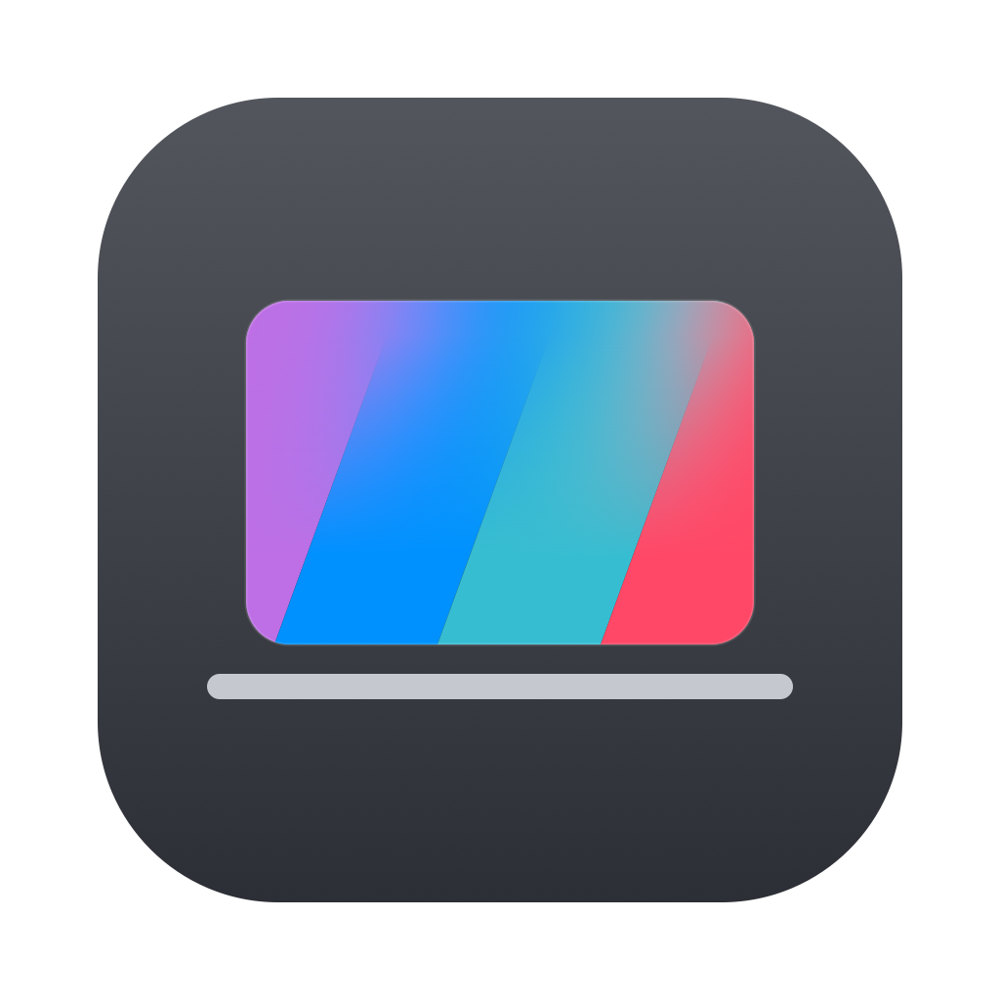

# MacLid

**The blur follows your lid.**

Close your MacBook and the screen melts away under your hands. Open it and it
comes back. Not an animation that plays when the lid shuts — the blur tracks the
real angle of the lid, continuously, so if you stop halfway the blur stops
halfway with you.

MacLid lives in the menu bar and nowhere else.

---

## Why it's built this way

**It never looks at your screen.** MacLid doesn't capture, record, or read a
single pixel of what you're doing. It paints a translucent layer on top and lets
macOS blur whatever is underneath — the same mechanism the system itself uses for
Control Center. That's why it asks for no permissions at all: no screen
recording, no accessibility, no camera, no files, no network. There is nothing to
grant, and nothing to think about before installing it.

**It reads a sensor almost nobody uses.** Most MacBooks quietly expose the angle
of their own lid over the HID sensor interface — the same class of device as a
keyboard, reporting a number in degrees. MacLid reads that number and maps it
onto the blur. Reading is all it can do: a sensor has nothing to command.

**It doesn't sit on your battery.** Watching a hinge sixty times a second, to be
told nothing has changed, keeps the CPU out of its deeper idle states all day.
So MacLid glances at the lid eight times a second while it's still, and only
switches to the fast rate while the lid is actually moving. Measured idle cost:
**0.4% CPU**. Turn the effect off and it stops reading entirely.

**It works on every Mac.** Where the sensor is available the blur follows the
real angle. Where it isn't — desktops, older laptops — the same effect runs as a
timed animation on sleep and wake. The About tab tells you which one you got.

**It's small.** An 812 KB app, about 2,000 lines of Swift, no frameworks
bundled, no background services, no login agents you didn't ask for. Drag it to
the Trash and it's gone.

---

## Installing

1. Download `MacLid.app`.
2. Drag it into your **Applications** folder.
3. Open it. A lid icon appears at the right of your menu bar.

The first time, macOS may say the app is from an unidentified developer. That's
because it isn't signed with a paid Apple certificate — nothing more. Right-click
the app → **Open**, confirm once, and you won't see it again.

## Using it

Click the lid icon:

- **The switch** turns the effect on and off.
- **Intensity** — how strong the blur gets by the time the lid is shut.
- **Start** — how early it begins: *right away* as you first tilt the lid, or
  *near closed* only at the end of the travel.
- **Launch at login** — have it there when you turn the Mac on.

**Settings…** opens the rest:

| Tab | What's in it |
| --- | --- |
| **Effect** | How soft the fade is, the style (adaptive, light, dark, smoke), and an optional colour tint — taken from your desktop picture, from your system accent colour, or one you pick |
| **Lid** | The exact angles where the blur starts and reaches full strength, a live reading of your lid angle, and a slider to preview the effect without touching the lid |
| **About** | Version and credits |

Everything is remembered between restarts.

---

## How the effect works

Two details do most of the work.

**The blur has no edge.** A blur that fades along a straight ramp leaves a
visible line where the ramp ends — the eye finds the break in the slope even
when the pixels are a smooth gradient. So the fade follows a smootherstep curve
instead, reaching both ends with zero slope, and the front travels past the
bottom of the screen so the last sliver still fades rather than stopping. There
is no point at which you can say the blur ends.

**The progression comes from the sweep, not the opacity.** Fading the whole
screen up as the lid closes reads as a flat veil getting denser. Instead the
masked front descends from the top edge — the part of the panel that physically
travels the furthest as the hinge closes — so at half-closed the top is genuinely
blurred while the bottom is still sharp.

The lid angle itself arrives in whole degrees, which would make the blur move in
visible steps, so each reading is interpolated over 0.12 seconds: long enough to
smooth the staircase, short enough that the blur stays glued to your hand.

---

## Requirements

- macOS 12 or later.
- Angle tracking needs a MacBook whose lid sensor is reachable — most models from
  the 2019 16-inch MacBook Pro onwards. Everything else falls back gracefully.

## Building it yourself

See [DEVELOPING.md](DEVELOPING.md). The app icon is drawn in code, and there's a
small probe for checking the lid sensor on any Mac.

---

By [frasntoro](https://github.com/frasntoro) — released under the
[GPL-3.0](LICENSE).
