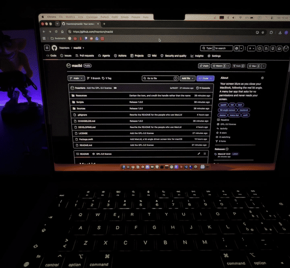

# MacLid

**The blur follows your lid.**

Close your MacBook and the screen melts away under your hands. Open it and it
comes back. Not an animation that plays when the lid shuts — the blur tracks the
real angle of the lid, continuously, so if you stop halfway the blur stops
halfway with you.

MacLid lives in the menu bar and nowhere else.

## New in 2.0

- **A blur that mists over instead of sliding.** The screen now fogs up from
  the top down, all of it at once, with the top a little ahead — no edge
  sweeping across it. The sliding front of 1.0 is still there as a style,
  *Curtain*, with a start that no longer lags behind the lid.
- **A soft arrival at any strength.** However strong you set the blur, it
  builds up gently over the first part of the closing and settles there.
- **Gradients.** Tint the blur with two colours, choose how they run across
  the screen, where they meet, and see it in a live preview.
- **A plainer glass.** The four material styles, which looked nearly the same,
  are gone; the blur is one clear glass, and colour does the rest.
- **Both angles at hand.** The menu bar panel now sets where the blur starts
  and where it's complete. Launch at login moved to a new *General* tab.

---

## Why it's built this way

**It never looks at your screen.** MacLid doesn't capture, record, or read a
single pixel of what you're doing. It paints a translucent layer on top and lets
macOS blur whatever is underneath — the same mechanism the system itself uses for
Control Center. That's why it asks for no permissions at all: no screen
recording, no accessibility, no camera, no files, no network. There is nothing to
grant, and nothing to think about before installing it.

**It reads a sensor almost nobody uses.** Most MacBooks quietly expose the angle
of their own lid over the HID sensor interface — the same class of device as a
keyboard, reporting a number in degrees. MacLid reads that number and maps it
onto the blur. Reading is all it can do: a sensor has nothing to command.

**It doesn't sit on your battery.** Watching a hinge sixty times a second, to be
told nothing has changed, keeps the CPU out of its deeper idle states all day.
So MacLid glances at the lid eight times a second while it's still, and only
switches to the fast rate while the lid is actually moving. Measured idle cost:
**0.4% CPU**. Turn the effect off and it stops reading entirely.

**It works on every Mac.** Where the sensor is available the blur follows the
real angle. Where it isn't — desktops, older laptops — the same effect runs as a
timed animation on sleep and wake. The About tab tells you which one you got.

**It's small.** An 852 KB app, about 2,400 lines of Swift, no frameworks
bundled, no background services, no login agents you didn't ask for. Drag it to
the Trash and it's gone.

---

## Installing

1. Download `MacLid.app`.
2. Drag it into your **Applications** folder.
3. Open it. A lid icon appears at the right of your menu bar.

The first time, macOS may say the app is from an unidentified developer. That's
because it isn't signed with a paid Apple certificate — nothing more. Right-click
the app → **Open**, confirm once, and you won't see it again.

## Using it

Click the lid icon:

- **The switch** turns the effect on and off.
- **Intensity** — how strong the blur gets by the time the lid is shut.
- **Starts at** — the lid angle where the blur begins.
- **Full at** — the lid angle where it's complete.

**Settings** opens the rest:

| Tab | What's in it |
| --- | --- |
| **General** | Launch at login, and a button that opens the releases page |
| **Effect** | The style (*Mist* or *Curtain*), intensity and softness, and the colour: plain glass, your desktop picture, a colour you pick, or a gradient |
| **Lid** | The two angles, a live reading of your lid angle, and a slider to preview the effect without touching the lid |
| **About** | Version and credits |

Everything is remembered between restarts.

## Making it yours

Nothing about the effect is fixed, and the defaults are only one point in a
fairly wide range.

**How it moves** — *Style* picks between two motions. *Mist*, the default,
fogs the whole screen at once with the top a little ahead. *Curtain* brings a
soft front down from the top edge.

**How much** — *Intensity* sets how far the blur goes by the time the lid is
shut, from a light haze to a screen you genuinely can't read. It decides where
the blur ends up, not how it arrives: the start is soft either way.

**How soft** — *Softness* shapes the motion. With *Mist* it sets how far ahead
the top stays: low, and you clearly see the blur coming down; high, and the
screen blurs almost as one. With *Curtain* it sets the width of the front: low
for a clear edge sweeping down, high for a long fade.

**When** — *Starts at* and *Full at* are the two lid angles that bound the
effect. Set the first high and the blur answers the moment you touch the lid;
set it low and nothing happens until the screen is nearly shut. Anything above
the start angle leaves your screen alone entirely, which is why the default
sits below the angle most people work at. The two can't cross: move one past
the other and it takes the other along.

**What colour** — *Tint* is plain *Glass* by default. *Wallpaper* takes the
colour of your desktop picture, weighted so flat grey areas don't dull it.
*Color* is one you pick. *Gradient* takes two, laid top to bottom, diagonally,
side to side or out from the centre, with *Mix* deciding where they meet and a
preview shaped like your screen. *Strength* sets how far the colour goes.

If you want to see what a setting does without closing the lid over and over,
the **Lid** tab has a slider that drives the effect by hand.

## Updates

MacLid is under active development, and new versions are on the way. They will
appear on the [releases page](https://github.com/frasntoro/maclid/releases) —
the same place the **Check for updates** button in the app opens.

---

## How the effect works

**The blur is shaped row by row.** Over the screen sits a mask that decides,
for every row from the top edge to the bottom, how much of the blur shows
through. Each motion is simply a rule for that: *Mist* lets every row fade in
over its own stretch of the closing, the lower ones starting later, so the
screen fogs up as a whole while still reading as top-down; *Curtain* makes the
rows above a descending line fully blurred and fades out the ones below it.
Either way, nothing ever has to slide.

**There is no edge to find.** Every fade follows an S-shaped curve, which
reaches both ends with zero slope. A straight ramp would leave a line where it
stops — the eye finds the break in the slope even in a smooth gradient.

**It arrives softly.** The blur builds up over the first quarter or so of the
closing on an ease-out curve: visible from the first degrees, settling into
full intensity without a corner. On opening it leaves the same way.

The lid angle itself arrives in whole degrees, which would make the blur move in
visible steps, so each reading is interpolated over 0.12 seconds: long enough to
smooth the staircase, short enough that the blur stays glued to your hand.
Longer animations, like the previews in the settings, are played frame by frame
through the same rule, so they keep the shape rather than cross-fading.

---

## Requirements

- macOS 12 or later.
- Angle tracking needs a MacBook whose lid sensor is reachable — most models from
  the 2019 16-inch MacBook Pro onwards. Everything else falls back gracefully.

---

By [frasntoro](https://github.com/frasntoro). The app is free to use; the
source is published for reading, not for reuse — see the [licence](LICENSE).
